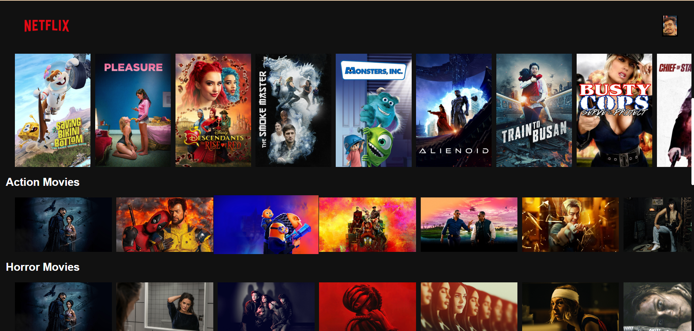

# Netflix-Clone

I have Developed a Netflix UI Clone using HTML5, CSS3, JS with the help of TMDB API for retrieving data. 
Functionalities used like FlexBox,Hover effects and Gradients.
JavaScript functions used like async, DOM and promises to fetch the api and get the data.
Other than that I have also used TMDB Api to fetch movies data.

### Features

1. Looks almost similar to Netflix.
2. All data is being retrieved real-time from TMDB data using TMDB API.
3. Has smooth card slider effect.

Here we will be getting movie name, images from same movie and other data from TMDB API Call.

## Images

